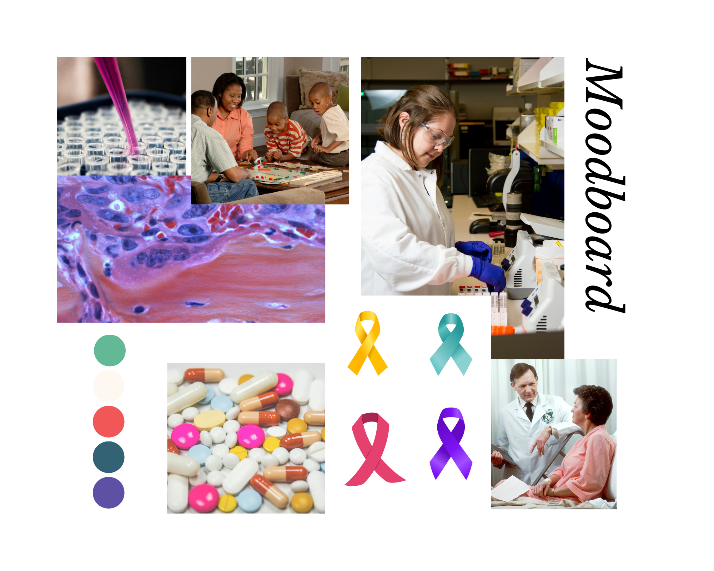
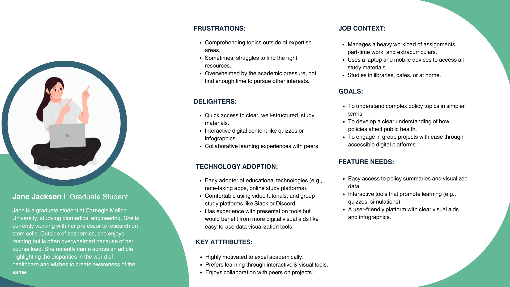
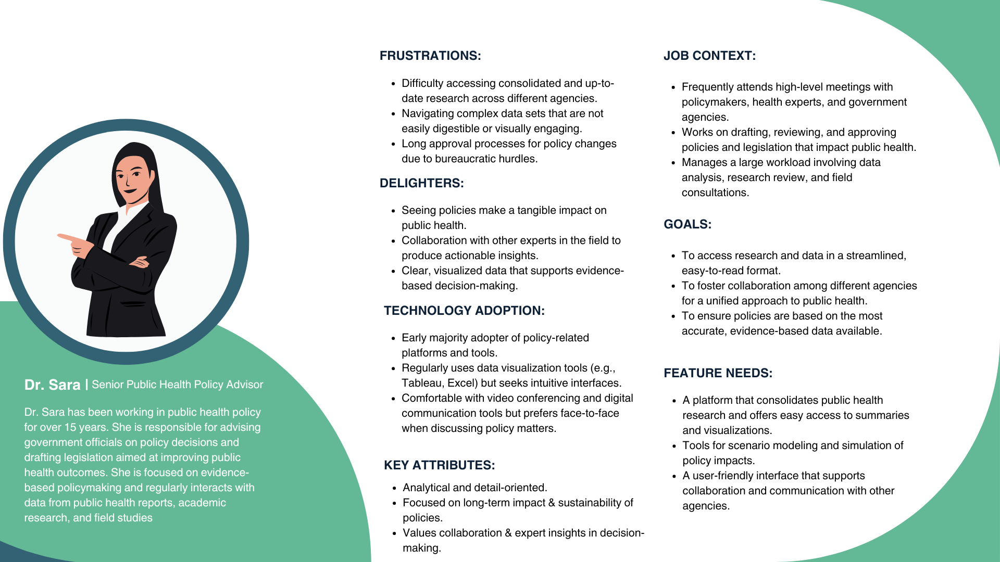

# Final Project: Part 2

## Wireframes and Storyboards 

For the wireframes and storyboards, I started working on Shorthand directly, this was primarily to make myself more comfortable and familiar with using the tool. 

[Shorthand Storyboard](https://preview.shorthand.com/XqziLd4cTWb9Ak6r)

## User Research and Interviews

### Interview Findings 

|   | Participant 1  | Participant 2  |  Participant 3 | |
|---|---|---|---|---|
|   | _**24, Female, Student**_  | _**24, Male, Student**_  |  _**26, Female, Student**_ |   |
|   | It would help to use the same colors for all the graphs and charts. | The call-to-actions are somewhat vague.   |  More data points can be incorporated, to emphasize the importance of interventions.  |   |
|   | Since the focus is only on US, this should be mentioned somehow at the beginning.   | The flow of the story is good overall.  |  Some of the existing policies can be explored. |   |
|   | The line chart took a little longer to interpret.   | Focusing on both socioeconomic and geographical factors might be a little too much.   |  Call-to-actions did not particularly speak to the target audience.  |   |
|   | Specifying what section of the society comes in the 'underrepresented category'.  | Some colors were too light compared to the theme.    |  The language used can be made simpler- so that the target audience can understand quickly. |   |
|   | _"Starting with a figure was helpful in catching my attention."_  | _"The title for the graph is insightful."_  |  _"I didn't know there was so much of a gap."_ |   |
|   | _"I would want to know to know what I can do as a student with limited resources."_  | _"For some of the slides, the text is a little hard to read because of the color contrast."_  |  _"To make it more engaging, you can end with a question."_ |   |

### In Class Peer Feedback (10/01)

**What Worked?**

The topic was well-thought out and the overall flow of the story was good.
The visualizations helped in storytelling without taking away the focus from the story.

**What Didn't Work?**

The call-to-actions need to be improved, it was not helping complete the story.
Some of the color choices didn't seem to work,  it was too contrasting.

**What Questions Came Up?**

Do you plan to focus on a specific type of cancer later in the story?
What are smaller interventions that can help?

**What New Inspirations Arose?**

Improving the color choices throughout, I decided to make a moodboard to help with this. (I had not made one before the peer feedback)

### Insights and Next Steps 

## Moodboard 

While I had not initially created a Moodboard as I felt that it might not be necessarily helpful, post the feedback sessions, I realized that a lot of visual elements (color, images, etc.) were not going well with one another, to address this I decided to create a moodboard as this would help with the cohesiveness of my project and bring everything together. Further, creating the moodboard also helped me explore certain aspects that I could incorporate for my story going forward. 

## Persona

The personas were created keeping in mind the target audience that I want to address while also incorporating a few elements from my interviews. While creating the persona, the main thing I had in mind was to focus on how they would perceive the story, diving deeper into whether the storyline that I created met their expectations and understanding. For now, I have created two primary personas, but I believe there would be secondary personas as well- these would be people indirectly involved in the experience such as healthcare workers, family members, and even caregivers.

## Data Source Acknowledgement 

[Miro](https://miro.com): I used Miro to design the User Research protocol, being a design student I was already comfortable with using the tool and hence felt that I would be able to create it faster using Miro.

[Canva](https://www.canva.com): For creating the persona and the Insights and Next Steps, I used Canva. 

[Persona Template](https://github.com/18F/federalist-design/wiki/Personas): This template was used to form the personas and decide which aspects need to be included.
