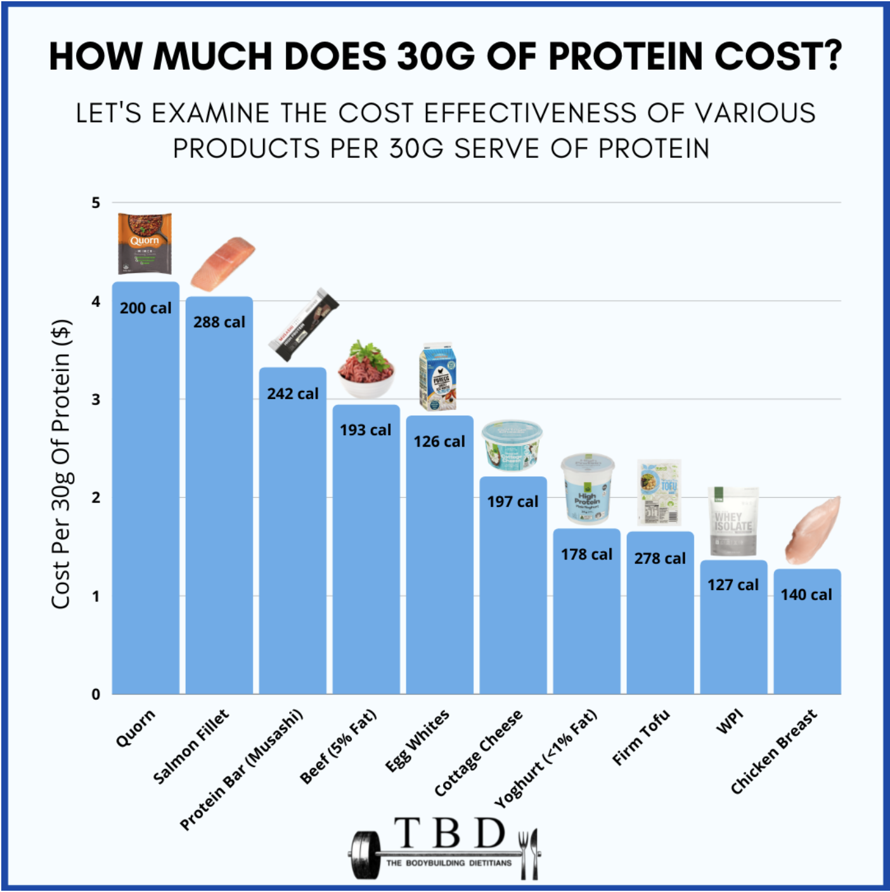
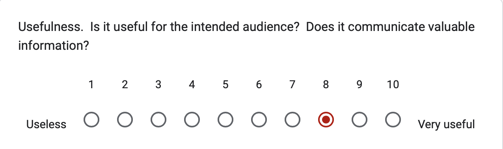
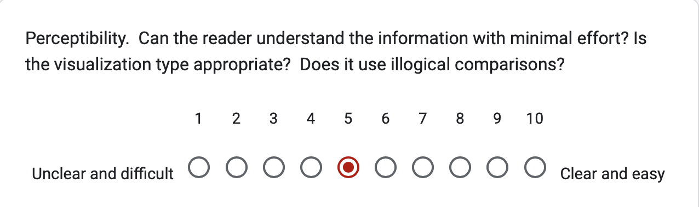
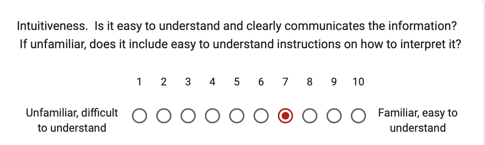
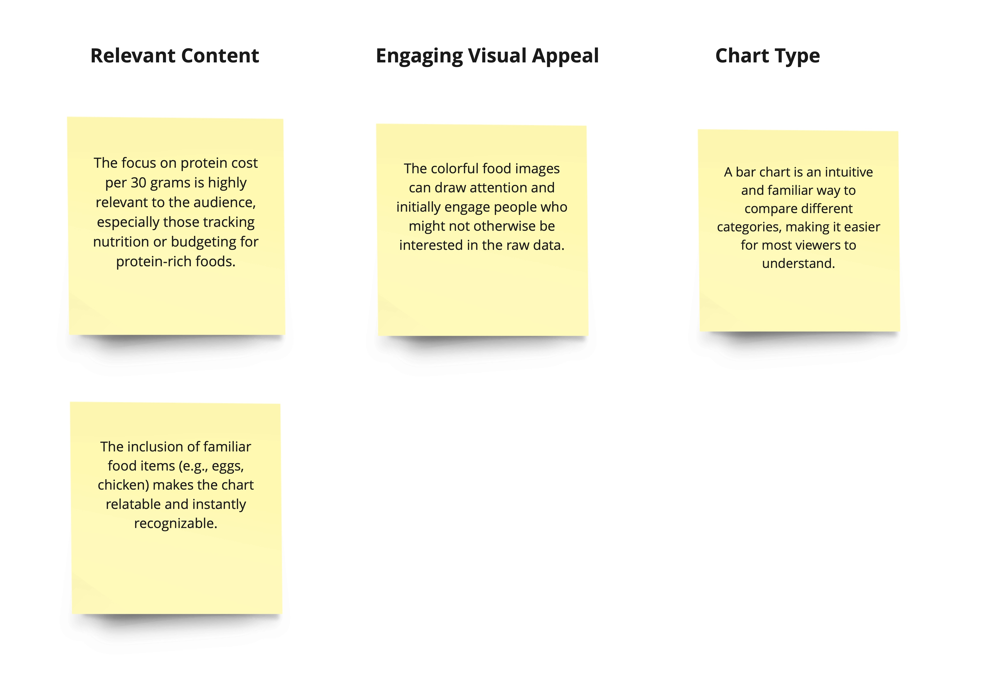

# Assignment: Critique by Design 
## Step 1: Finding a Data Visualization

For this assignment, the data set that I choose to work with is from an article published on Lifehacker, written by Beth Skwarecki, and the supporting Data Visualization was created by Brittany Rosenau. The data mentions and analyzes the various sources of protein available and contrasts their costs based on certain weights of each. I have spent significant time reading about how a healthy diet can often be very expensive to follow for the average consumer which piqued my initial interest in the article. Based on my interest in maintaining a healthy diet, I chose this specific data visualization to explore how effectively it communicates cost comparisons for protein sources. 

Further, upon seeing the data visualization, I noticed that there are opportunities to make it easier to interpret without spending so much time inferring the data. While the original visualization aims to deliver useful information, I felt that certain design elements (explained in Step 2) made the data difficult to understand and might not be helpful for the intended target audience (expanded on in Step 2). Thus, I decided to work with this data set and aimed to apply my learnings to make it more insightful and easy to follow. 

**Data Visualization:** The Bodybuilding Dietitians, [What Are The Cheapest High-Protein Foods?](https://www.thebodybuildingdietitians.com/blog/how-cost-effective-is-your-high-protein-diet)

**Data Source:** Lifehacker, [The Cheapest Ways to Get Your Protein Right Now](https://lifehacker.com/the-cheapest-ways-to-get-your-protein-right-now-1850001760)

## Step 2: Critique The Visualization 

For the critique of the original data visualzaiton, Stephen Few's Data Visualization Effectiveness Profile has been used as the method. The method helped critique the design based on several parameters falling under the broad categories of Informative and Emotive. For each of the criteria I mentioned both what worked and what didn't, additionally, I have also included the reason as to why a particular design decision does not work in this context.

### Informative

**Usefulness**

When thinking of the intended audience which may include individuals such as professional trainers, dietitians, fitness enthusiasts, or budget-conscious families, the information is highly relevant as the data has a two-fold focus, emphasizing both cost and calories allowing for an approach to dietary planning that takes into account both economic and nutritional factors. The reason for giving it an 8 is considering that there is scope for improvement in terms of the visual design, the images for each source can be distracting, and eradicating this would make the data more direct and easier to comprehend. 

**Completeness**

Considering the evaluation based on completeness, the information is sufficient since the chart provides clear data on the cost and caloric content per 30 grams of protein for various food items, which is the core information needed for the stated purpose of comparing cost-effectiveness. It also covers a diverse range of protein sources, including plant-based options and animal-based options. However, where it lacks is in terms of providing enough relevant context. The chart does not include any comparative benchmarks, such as average costs, industry standards, or historical data, which could help frame the provided information more meaningfully and would significantly improve the user's ability to evaluate the information effectively. 

**Perceptibility**

For the purpose of the data represented here, the choice to use a bar chart is effective since the purpose is to compare quantities like cost across different categories. The images are distracting, as they introduce unnecessary visual strain that doesn't contribute to understanding the data better. Removing pictures would help reduce cognitive load. Further, the hierarchy can be improved upon in regards to the title and the explanation below it. Having all of the text in block letters adds additional unnecessary strain to the eyes. 

**Truthfulness**

The visualization is accurate. The heights of the bars correspond accurately to the values they represent, the chart correctly scales the bars so that their heights are proportional to the cost per 30 grams of protein for each food item. The visualization could be improved by providing sources for the data at the bottom of the graph.

**Intuitiveness**

The bar chart is a widely used format for displaying comparative data, thus making it a good choice for a general audience. Improving intuitiveness could involve simplifying the visual design to focus more on the data itself, reducing the use of multiple images, and possibly including brief instructions or clearer labels that guide the viewer through the data more clearly. This would make the chart more accessible and easier to understand for a wider range of viewers.

### Emotive

**Aesthetics**

While the data is not necessarily ugly it lacks an overall aesthetic appeal to it which if enhanced could improve the visualization. There is an attempt to make the chart visually engaging, however its aesthetics can be perceived as too busy or lacking in professional polish. The use of various colors and images, although initially eye-catching, may ultimately serve more as a distraction than an enhancement. Improving the aesthetics could involve eliminating the use of food images, and focusing on a cleaner, more professional design that enhances the data's visibility and the viewer's ability to engage with the content without visual distractions. This would make the chart not only more pleasing but also potentially more effective at communicating its intended message.

**Engagement**

For an audience interested in nutritional or financial data, the chart’s content is relevant, but maintaining engagement requires a straightforward and appealing presentation. The busy nature of the design (the colors used, having to find the associated cost with each bar) may cause viewers to disengage once the initial visual interest fades, especially if they have to work hard to derive insights.

### Overall Observations 

The chart’s primary message (comparing costs per 30 grams of protein) is highly relevant and could be quite useful. However, the message gets lost in the design, as it forces the audience to work harder than necessary to interpret the data.

**What worked well:**

- Relatable Subject Matter: The use of familiar food items makes the data more approachable and relatable to viewers who are interested in the cost of nutrition.
  
- Appropriate Chart Type: The bar chart format is appropriate for comparing costs across different items, although the design could be simplified.

**What didn't work:**

- Distraction from the Core Data: The images ultimately pull focus away from the numbers and comparisons, which should be the primary concern.

**What I would do differently:**

- Improve Labeling and Spacing: I would enhance the clarity of text labels, making them more prominent and easier to read by increasing font size and reducing the amount of competing visual elements.

- Simplify the Design: I would remove the images of food and stick to a clean bar chart with uniform colors to make the data easier to read and interpret.

### Primary Audience for the data:

**Why the visualization is effective for reaching the intended audience**

 

### Analyzing the Methodology 

This method—using Stephen Few’s Data Visualization Effectiveness Profile—was highly successful in evaluating the data visualization. These aspects covered a broad range of considerations that are essential to determining the success of a visualization, from whether it meets audience needs to how easily it can be understood and acted upon. 

**Measures that I would add:**

**Accessibility:** The evaluation doesn’t take into account whether the visualization is readable for people with visual impairments (e.g., color blindness). Considering color choices or ensuring text legibility for all users is critical, especially for public-facing data.

#### Stephen Few’s Data Visualization Effectiveness Profile Vs The Good Charts Method

**Few’s Effectiveness Profile** takes a very technical approach by focusing on key areas like **usefulness**, **completeness**, **perceptibility**, **truthfulness**, **intuitiveness**, **aesthetics**, and **engagement**. It’s a technical way to assess how well a visualization performs in each of these areas, which makes it ideal for a detailed, analytical breakdown. On the other hand, the **Good Charts Method** from *Good Charts* by Scott Berinato centers more on the **storytelling** and **emotional impact** of a visualization. The good Chart's framework encourages designers to prioritize **clarity**, **form**, **aesthetics**, and **narrative**, with a focus on how the design will be interpreted by the audience. If our goal is to create a visualization in a business setting, **Few’s Effectiveness Profile** is likely the better guide. But if we are aiming to **influence, inspire, or tell a compelling story**, the **Good Charts Method** would help us create a design that connects emotionally with our intended target audience.

## Step 3: Wireframe a Solution

While sketching out the solution, I emphasized on the observations I discovered during the critique and focused on improving the ones that would help make the chart more insightful, easy to navigate, and comprehend for all segments of the targeted audience. The sketch is an attempt to visualize the big ideas that I had for my redesign, however, the sketch is a low-fidelity prototype in this case. 

**Sketch:**

**Digitalized:**

**Redesign Decisions (Context):**

**Title:** I changed the title to 'Protein on a Budget: Cost Comparison of Popular Sources', this is more insightful and instantly gives the audience an idea that they will be able to compare the costs of different protein sources. Additionally, adding in the word budget helps readers establish a sense of trust that this is something that would be affordable thus breaking the common misconception of healthy food being expensive. 

**Segmentation:** I noticed that the data set was rich and had filters for whether a particular protein source was vegan or vegetarian, however, this was not utilized in the data visualization earlier. I decided to segment the various protein sources into these categories, thus making the chart more accessible to people with dietary restrictions or preferences. 

**Cost & Weight Display:** Since the main takeaway from the visualization is for the intended audience to be able to infer costs and compare them, I decided to mention the exact costs for each source right next to it, this is the most important information on this graph and having this clearly mentioned makes it easier for the comparison too. I modified the weights changing it from a uniform scale to a scale that was generally used based on average consumption, my idea behind this was to include weights that they would end up consuming for each source and compare the prices based on that. 

**Images & Calories:** The images added to a visual clutter without adding any value to the data. (some of them are even unclear thus not serving the purpose. While the calories may seem helpful at first glance, it is not directly related to the information that we are trying to portray in this visualization thus leading to an information overload for the users considering that they will have to look at costs, weights, and calories. These two factors were increasing the cognitive load when processing information on the bar chart thus I decided not to include them in my redesign. 

## Step 4: Test the Solution

Testing helps us understand how our intended audience will perceive the data visualization. In this case especially, since it was a scenario of redesigning of an existing chart, testing helped me understand what factors were the most important to users, their initial reactions, and even what they wanted to see in the chart for further clarity. Throughout this process, I was able to identify certain blind spots that I earlier missed out on and even reflect on some of my decisions that weren't the best choices to make considering the context of this data visualization.

### Interview Protocol

To better organize and make the most out of the testing process, I decided to develop a detailed interview protocol that helped me focus on the areas that I was looking to get feedback on. Following a protocol also helped when the conversations started to move towards different topics based on the interview responses, it helped me stay on track and be more mindful of the time. 

### User Interviews (Testing Session #1)

For the purpose of getting accurate information, I recruited participants for the interview who were part of the intended target audience. 

### In-Class Critique (Testing Session #2)

The peer feedback was helpful for further refining the visualization and implementing some new ideas to the redesign and helped validate the opinions from the previous critique session too. 

### Interview Insights

**Similarities:** 

- The title helped get context and made the chart easier to interpret. 

- The segments were helpful and easy to follow.

**Differences:**

- Understanding of the target audience was limited to one of the users.
  
- One user wanted to see calories again, however, the other three had a contrasting opinion.

**What patterns emerged:**

- Excluding uniformity in the weights made it confusing for the users.
  
- Thecolor choice was not the best.

  
**What I learned from the feedback:**

- The data had to be represented in a certain order (either ascending or descending).
  
- Users wanted to see an average for the cost or consumption intake.

## Step 5: Building a Solution 

The final step served as an accumulation of all the steps until now, my approach was to take into account the original graph, my critique based on it, the redesigned wireframes, and feedback from both testing solutions- and based on this thinking of what the best way of showing the graph would be. Prioritizing which feedback to include and which were the ones less important. Seeing the final chart come together was extremely rewarding after going through the entire process. 

<noscript></noscript><object class='tableauViz'  style='display:none;'><param name='host_url' value='https%3A%2F%2Fpublic.tableau.com%2F' /> <param name='embed_code_version' value='3' /> <param name='site_root' value='' /><param name='name' value='CritiquebyDesign_17267050814750&#47;RedesignedDataVisualization' /><param name='tabs' value='no' /><param name='toolbar' value='yes' /><param name='static_image' value='https:&#47;&#47;public.tableau.com&#47;static&#47;images&#47;Cr&#47;CritiquebyDesign_17267050814750&#47;RedesignedDataVisualization&#47;1.png' /> <param name='animate_transition' value='yes' /><param name='display_static_image' value='yes' /><param name='display_spinner' value='yes' /><param name='display_overlay' value='yes' /><param name='display_count' value='yes' /><param name='language' value='en-US' /><param name='filter' value='publish=yes' /></object>
                

**Changes Incorporated:**

* Since I received unanimous feedback on the color scheme being too loud I decided to change it and cooler colors, however, the context for the colors was changed in this version (explained in the next point).
* Learning about how important it was for users to be able to see the average pricing was an insightful aspect that I had missed out on. I added a line showcasing the average based on different categories. The colors are divided based on this too. The ones below average are in gray and the ones above average are in blue. 
* The data was showing price points hence it was essential to incorporate a sorting order, I have added both ascending and descending order for this. 
* To make the navigation easy and interactive there is a dashboard primarily used for filtering out options based on what the users wish to see. 

**What my redesign shows:**

Through my redesign I aim to provide maximum takeback for users in the minimum time possible, I do not want someone to spend a lot of hours on this, I believe that within a few minutes (3-4) they should able to understand everything and this is what I attempted to incorporate. This started right from the title, reading which users will easily be able to infer the context, coming to the graph there is the detailed list (All) which shows the list of all sources of protein, has the average and price further there are additional filters that help filter out the vegetarian and vegan and none of these (meat- if a user clicks on no for both) options available. This makes the sorting process simpler and within 2-3 clicks the users can all possible combinations and make inferences based on them.

**Reason for selecting this data:**

As mentioned previously, the topic of this data was enough to get me interested in it, further, some of the decisions that I took were considering the fact that this was a large data set however in the original visualization a lot of important aspects had been missed out on. Since I wanted to list all sources I decided to switch to a horizontal bar graph instead of a vertical one. 

**What I attempted to show or do differently:**

Through the visual, I attempted to reduce visual clutter, to the extent of making bold decisions like not including defined numbers for the x-axis. However, the reason for this was to make the chart easy to read and quick to gras,p and thus to reduce eye travel I decided to remove some of the conventional aspects included in bar graphs (values on the x-axis and key)

*Feedback not incorporated (&Why):
A few of the users during the interview mentioned that including the calories would help some of the intended target audience members, however with including this, there was a high possibility of excessive cognitive load for the users and increased time for processing the information, hence I decided to skip it.* 

### Data Source Acknowledgement

[What Are The Cheapest High-Protein Foods?](https://www.thebodybuildingdietitians.com/blog/how-cost-effective-is-your-high-protein-diet): This is the original data visualization that I used for the critique and basis of the redesign.

[The Cheapest Ways to Get Your Protein Right Now](https://lifehacker.com/the-cheapest-ways-to-get-your-protein-right-now-1850001760): This is the source of the data set which was used in the redesign. 

[Grammarly](https://app.grammarly.com): The grammar checker and AI tool was used to help frame the sentences better and check for additional grammar and spelling errors. 

[Tableau Community](https://community.tableau.com/s/): I used this when I was facing some troubles with the public view of my graph.

[Watch Me Viz](https://www.youtube.com/watch?v=45pgu_SrZsg&list=PLX-uPHRG0cLb697Ie-ZGSObRLLNhxzJGK&index=53): This was used at points when certain things were not working for me on the backend and to get an overall understanding of what functions to use for buiding the dashboard.

