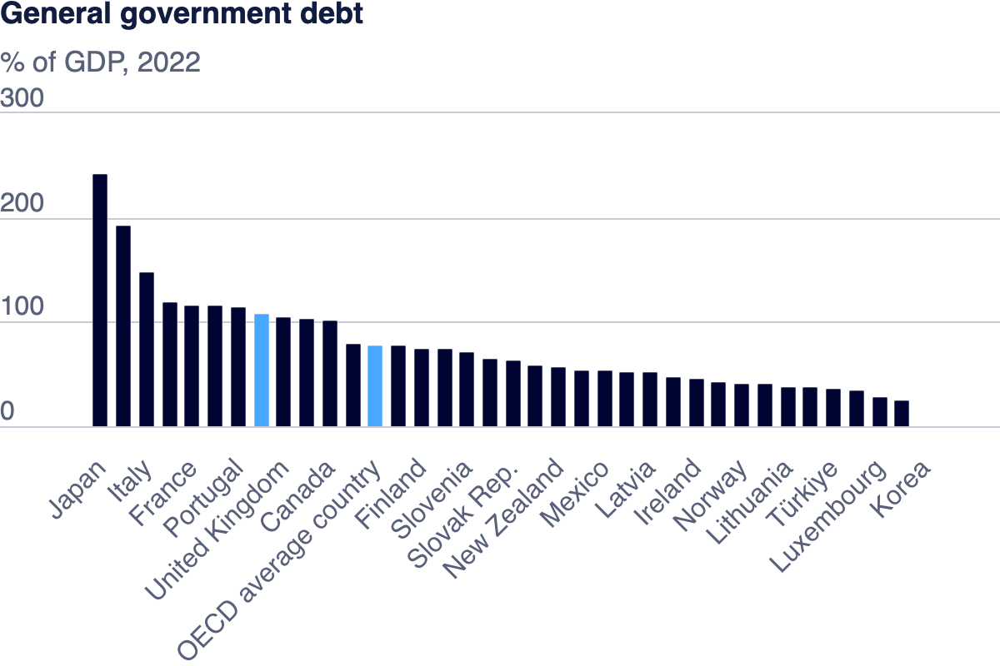

# Assignment: Visualize Goverment Debt 
A government debt ratio, typically expressed as the debt-to-GDP ratio, is a measure of a country's total government debt relative to its gross domestic product (GDP). It provides insight into a government's ability to repay its debt. A higher ratio can signal financial risk, while a lower ratio indicates stronger economic health. However, the impact also depends on factors like interest rates, economic growth, and investor confidence. 
## Part 1

The bar chart in this case helps compare the government debt levels of various countries as a percentage of their GDP. We see Japan having the highest government debt as a percentage of GDP, exceeding 200%. Other countries are listed in descending order, with Korea having the lowest percentage. Other countries are listed in descending order, with Korea having the lowest percentage. The chart also includes the OECD average as a reference point. 

## Part 2

<noscript></noscript><object class='tableauViz'  style='display:none;'><param name='host_url' value='https%3A%2F%2Fpublic.tableau.com%2F' /> <param name='embed_code_version' value='3' /> <param name='site_root' value='' /><param name='name' value='OECDDataSet&#47;OECDDataSet' /><param name='tabs' value='no' /><param name='toolbar' value='yes' /><param name='static_image' value='https:&#47;&#47;public.tableau.com&#47;static&#47;images&#47;OE&#47;OECDDataSet&#47;OECDDataSet&#47;1.png' /> <param name='animate_transition' value='yes' /><param name='display_static_image' value='yes' /><param name='display_spinner' value='yes' /><param name='display_overlay' value='yes' /><param name='display_count' value='yes' /><param name='language' value='en-US' /><param name='filter' value='publish=yes' /></object>
             

The heat map displays government debt data for various countries from 1995 to 2003 using a color gradient from blue to orange, indicating the range of values, where blue represents lower values and orange represents higher values. The values represent percentages and are color-coded based on their magnitude. Countries such as Japan, Greece, and Italy have the highest debt percentages, shown in the orange range, while countries like Finland, Denmark, and Sweden have lower percentages, shown in blue. The data is organized by country on the left and years across the top, showing a trend of increasing or decreasing debt levels over time for each country. The color scale at the top right indicates the range of values from 6.6 to 238.7.

## Part 3

<noscript></noscript><object class='tableauViz'  style='display:none;'><param name='host_url' value='https%3A%2F%2Fpublic.tableau.com%2F' /> <param name='embed_code_version' value='3' /> <param name='site_root' value='' /><param name='name' value='OECDDataSetPart3&#47;OECDDataSetPart3' /><param name='tabs' value='no' /><param name='toolbar' value='yes' /><param name='static_image' value='https:&#47;&#47;public.tableau.com&#47;static&#47;images&#47;OE&#47;OECDDataSetPart3&#47;OECDDataSetPart3&#47;1.png' /> <param name='animate_transition' value='yes' /><param name='display_static_image' value='yes' /><param name='display_spinner' value='yes' /><param name='display_overlay' value='yes' /><param name='display_count' value='yes' /><param name='language' value='en-US' /><param name='filter' value='publish=yes' /></object>
                

The chart visualizes government debt as a percentage of GDP for various European countries from 2009 to 2019. Each line represents a different country, and the data trends over time highlight fluctuations in government debt levels. The y-axis represents the percentage value of government debt relative to GDP, ranging from 0 to 160. The x-axis spans the years from 2009 to 2019. Notable lines include Italy and Greece, which are among the highest in debt ratios, showing an increasing trend, particularly around 2012-2014, followed by a more stable or slightly declining trend. Other countries display varied trends, with some showing consistent debt levels and others showing slight increases or decreases over the decade. A legend on the right lists the countries included in the chart, with each country's line color corresponding to its entry in the legend.

### Methods of Data Visualization
There are several methods of data visualization that I use depending on the type of data and the insights I want to convey. For example, bar charts are my go-to when I need to compare discrete categories or groups. They make it easy to highlight differences between items, especially when I’m comparing multiple datasets side by side. However, I avoid them when dealing with continuous data or trends over time, since they’re not as effective in those cases.

When I need to show proportions within a whole, I use pie charts. They’re great for representing percentages, but I find they can be tricky when comparing individual segments, especially if the differences are small. For trends over time, I rely on line charts. They’re excellent for showing changes across months or years by connecting data points, making them ideal for tracking continuous data.

If I’m trying to explore relationships between two variables, I use scatter plots. They’re perfect for identifying patterns or correlations, though they can get a bit overwhelming when there are too many data points. For displaying the distribution of continuous data, I turn to histograms. They help me spot patterns like skewness or the frequency of values within certain ranges.

Each visualization method has its strengths and weaknesses, so I always choose based on the data I’m working with and the story I want to tell.
Source: https://datavizcatalogue.com

#### Method for Part 3: Line Graph

1. Time Series Analysis: Line graphs are helpful for displaying data over time. In this case, the graph helps me show the government debt ratio from 2009 to 2019 across multiple countries, making it easy for the reader to interpret the data over multiple years.

2. Comparative Insights: The different colored lines for each country make it easy to compare multiple data points within a single chart. This helps identify which countries have higher debt ratios and how these ratios evolve relative to others over time.

3. Clarity and Simplicity: Line graphs are simple and easy to follow, making them accessible to a broad audience. They clearly demonstrate how variables interact over time, which is essential when dealing with complex data sets like economic indicators.

4. Highlighting Trends and Patterns: Line graphs are useful for showing growth trends or cycles in data, such as the increases or decreases in government debt. This visualization is key for noticing periods of economic stability or crisis.

<noscript></noscript><object class='tableauViz'  style='display:none;'><param name='host_url' value='https%3A%2F%2Fpublic.tableau.com%2F' /> <param name='embed_code_version' value='3' /> <param name='site_root' value='' /><param name='name' value='OECDDataSet&#47;OECDDataSet' /><param name='tabs' value='no' /><param name='toolbar' value='yes' /><param name='static_image' value='https:&#47;&#47;public.tableau.com&#47;static&#47;images&#47;OE&#47;OECDDataSet&#47;OECDDataSet&#47;1.png' /> <param name='animate_transition' value='yes' /><param name='display_static_image' value='yes' /><param name='display_spinner' value='yes' /><param name='display_overlay' value='yes' /><param name='display_count' value='yes' /><param name='language' value='en-US' /></object>
             
